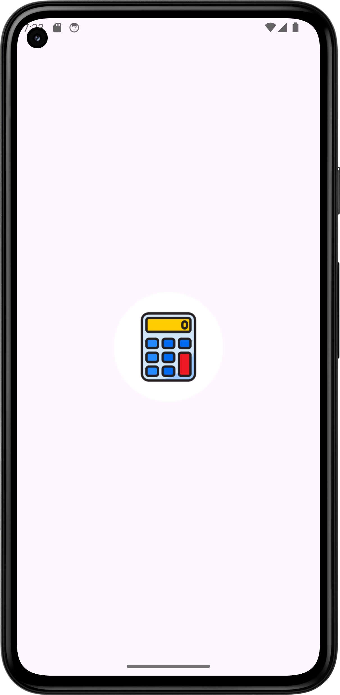
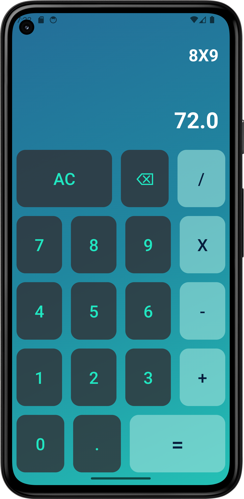

# Kotlin Calculator App

A fully functional **Kotlin Calculator Application** that features a splash screen, gradient animated background, and a modern UI. The app allows users to perform basic arithmetic operations like addition, subtraction, multiplication, and division with an intuitive and aesthetically pleasing interface.

## Features

- **Splash Screen**: A clean, modern splash screen shown when the app is launched.
- **Animated Gradient Background**: A continuously animated gradient provides a dynamic background for the calculator.
- **Modern UI**: The calculator's UI is designed with user-friendliness in mind, featuring large buttons and easy-to-read text.
- **Basic Arithmetic Operations**: Supports addition, subtraction, multiplication, and division.
- **Real-Time Calculation**: Displays intermediate results as the user enters expressions.
- **Edge-to-Edge Display**: Utilizes full screen on supported devices.
- **Backspace Functionality**: Users can delete the last entered digit or operator.
- **Custom App Icon**: The app has custom app icon, different from the default android label.

## Screenshots

| Splash Screen | Calculator Screen|
|---------------|------------------|
|||

## Project Structure

### XML Layout File

- The layout consists of multiple `LinearLayout` and `ConstraintLayout` views to organize the screen into buttons and result display areas.
- **TextViews** are used to display the input expression (`workingsTV`) and the result (`resultsTV`).
- Buttons for numeric values and arithmetic operators are arranged in rows for a calculator-like feel.

### XML Design Highlights

- **Animated Gradient Background**: Defined with `android:background="@drawable/gradient_animation"` in the parent `LinearLayout`.
- **TextViews for Input and Output**: The layout supports dynamic updating of the calculation expression and the result.
  
### Kotlin Code

The app's functionality is handled by the `CalcScreen.kt` file, where methods are defined to process button clicks, update the display, and perform calculations.

#### Key Functions

1. **`allClearAction`**: Clears all input and result fields.
2. **`backSpaceAction`**: Deletes the last entered digit or operator.
3. **`numberAction`**: Handles the number and decimal button clicks.
4. **`operationAction`**: Processes the operator buttons (`+`, `-`, `X`, `/`).
5. **`equalsAction`**: Performs the arithmetic calculation when the equals button is pressed.
6. **`calculateResults`**: Parses the input expression and computes the result.
7. **`multiplyDivisionCalculate`**: Handles multiplication and division operations.
8. **`addSubtractCalculate`**: Processes addition and subtraction operations.
9. **`digitsOperators`**: Extracts digits and operators from the input expression for calculation.

### Animation

- **Gradient Animation**: The `AnimationDrawable` is used to animate the gradient background with enter and exit fade durations.

## How to Run

1. Clone this repository.
2. Open the project in Android Studio.
3. Sync the Gradle files and run the project on an Android device or emulator.

```bash
git clone <repository-url>
```

## Future Enhancements

- Support for advanced operations like exponentiation, square root, and memory functions.
- Additional themes and customization options for the calculator's appearance.
- Improved error handling and expression validation.

## License

This project is licensed under the MIT License.
